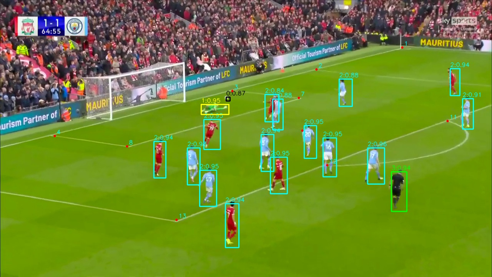

# ⚽ AI Player Tracking in Football Match

AI-powered real-time player tracking system for football (soccer) matches using Computer Vision and Deep Learning.

This project detects, tracks, and analyzes player movements from match videos to generate tactical insights, performance metrics, and positional analytics.

It is helpful for the coaches to make decision of their effective strategies in the matches.

# 🚀 Features

- 🎥 Real-time player detection from match video

- 🧠 AI-based multi-object tracking

- 🏃 Player movement & heatmap analysis

- 🎯 Ball tracking (optional module)

- 🗺 Tactical formation recognition

- 📈 Data export (CSV / JSON / API)

- 🖥 Live dashboard visualization

# 🛠 Tech Stack

- Python

- OpenCV

- PyTorch

- YOLOv11 (Object Detection)

- DeepSORT / ByteTrack (Tracking)

- NumPy / Pandas

- Matplotlib / Plotly

- FastAPI (Optional API backend)

# Contact us

- Telegram: https://t.me/NeilunoSoftware
- WhatsApp: +1 (437) 374-0319
- Email: business@neiluno.io
